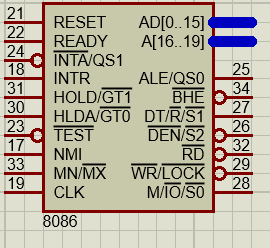
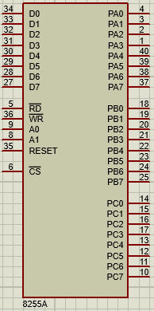
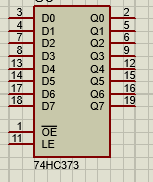
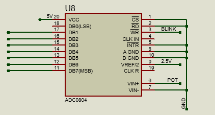
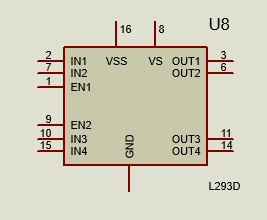

<h1 align="center">8086_steppermotor_assembly</h1>

<p align="center">
  
  <br>
  <i>Using 8086 Microprocessor to control Stepper motor direction and speed 
    <br> then showing the current speed value on 7-seg display and the direction through Blinking Led.</i>
  <br>
</p>

## Table of contents

- [Quick start](#Quick-start)
- [Code Flow](#Code-Flow)
- [Used Devices](#Used-Devices)
- [Components discription](#Components-discription)
- [Controlling the motor's speed](#Controlling-the-motors-speed)
- [GETSPEED function](#GETSPEED-function)
- [GETDSPLYD function](#GETDSPLYD-function)
- [Circuit Diagram](#Circuit-Diagram)
- [Features](#Features)
- [Team members](#Team-members)

## Quick start

- in order to run the [circuit](https://github.com/Mohamed-Fathy-Salah/8086_steppermotor_assembly/blob/main/stepper%20motor_project.pdsprj) you have to install at least proteus vertion 8. 
- Clone the repo: `git clone https://github.com/Mohamed-Fathy-Salah/8086_steppermotor_assembly.git`


## Code Flow

   As long as the ON/OFF switch is closed the main process runs in an infinite loop.</br></br>
Before running the motor we have to calculate some global variables.</br>
Firstly it calls the `GETPRESSED` process to read from port c the state of the direction and the HALF/FULL step then update the HDIR variable.
Then it calls the `GETSPEED` process to get the input from the potentiometer to calculate the right delay as the user wants after that it reset the write pin of the ADC to convert the analog value to digital and set this pin again at the end of the process for future use. then it checks the HDIR value to see whether to turn the led on or off.</br></br>
After the delay has the right value from the potentiometer and HDIR (the direction variable) has the right value it's time to call the RUN function.</br>
In the `RUN` function it firstly checks the direction to see whether the motor will rotate in clockwise direction or anticlockwise direction, Then it checks the step mode to rotate the motor in full step of half step. so it’s able now to run in the desired mode and direction.</br></br>
The remaining part related to the speed Display on the screen.</br>
Then `GETDSPLYD` PROC calculate the speed of the motor that will be displayed on the 3-segments ranging from 28 to 100 depending on the minimum and the maximum delay value the motor can handle. and store the result in the DSPLYD global variable.</br>
Finally the `DISPLAY` PROC which will simply take the value of the speed stored in the DSPLYD global variable and display it on the segments connected to the second i/o device.

## Used Devices
- 8086 microprocessor
- 74HC373 Latch
- 8255A I/O device
- Stepper Motor
- ADC0804 Digital to Analog Converter
- L293D Motor Driver Ic
- Resistors
- LED
- Switch
- potentiometer
- Battery

## Components discription
### 8086
<p>
  8086 is a microprocessor that have 20 bit for address bus and 16 bit for data bus.
  it's used here to control all the devices including the stepper motor , led , display
  </p>
<div style="display:inline-block; ">
  
<ul style="width:66%;float:left; display:inline-block;">
    <li> AD--->address/data bus . AD0-AD15 for data bus , AD0-AD19 for address bus </li>
    <li> ALE---> address enable latch , a positive pulse generated each time the processor begins any operation. this signal indicates the availability of a valid address on the address/data lines</li> 
    <li> RD--->used to read signal</li>
    <li> WR--->write signal . used to write the data into the memory or the output device</li>
    <li> RESET---> used ot restart the execution . it causes the processor to immediately terminate its present activity . this signal is active high for the first 4 clock cycles to reset the microprocessor</li>
    <li> READY---> indicates that the device is ready to transfer data . when it's low it indicates wait state</li>
    <li> HOLD--->indicates that external devices are requested to access the address/data buses </li>
    <li> MN/MX---> minimum/ maximum . indicates what mode the processor is to operate in . when high it operates in minimum mode</li>
  </ul>
  
</div>
<hr>

### 8255A
<div style="display:inline-block; ">
  <p style="width:80%;float:left; display:inline-block;">
  The 8255A is a general purpose programmable I/O device. It consists of 3 ports PORTA, PORTB and PORTC. And it has 3 modes of operation. Mode 0, Mode 1 and Mode 2 to control which ports are going to be input and output. In our circuit we used 2 8255A devices, one of them is configured to make port a, b, c as an output ports and the other one configured to make port a input and port b, c output and both of them operate in mode 0. </p>

</div>
  <hr>
  
### latch
<p>latch is used as a memory to get the address from the microprocessor to read from or write to the I/O devices</p>
<div style="display:inline-block; ">
  <ul style="display:inline-block;width:70;float:left;">
  <li>OE ---> enable output when low</li>
  <li>D0-D7 ---> data input</li>
  <li>Q0-Q7 ---> data output</li>
  <li>LE ---> latch enable input</li>
  </ul>
  
</div>
  <hr>
  
### ADC
<h5> analog to digital converter used to read analog voltage from potentiometer and convert it to digital then send this value to the I/O device </h5>
<div style="display:inline-block; ">
<ul style="width:66%;float:left; display:inline-block;">
    <li> CS---> is grounded to operate the ADC (active low) </li>
    <li> WR---> set and reset this bit to convert the data from analog to digital </li> 
    <li> RD---> after the conversion from analog to digital we set this pin to low to bring data from internal registers to output pins (DB0-DB7) </li>
    <li> DB0-DB7---> we get the digital data which is equivalent to the voltage on potentiometer and this value will be varied to get different values of motor speed (varying the delay between every step) </li>
  </ul>
  
</div>
  <hr>
  
### Stepper motor
<div style="display:inline-block; ">
  <span style="width:74%;float:left; display:inline-block;">
<p>
  - DC motor that move in discrete steps giving the illusion of rotation </br>
  - It devides the complete rotation into number of steps ,Each stepper motor will have fixed step      angle</br>
  - this motor is drived by L293D Motor Driver</br>
  -stepper motor are basically two types :Unipolar & bipolar
  <ul>
    <li><h5>unipolar :- </h5> has 5 or 6 wires ,this happens by tying each 2 coils from one end 
then there are 2 common wires as shown  , unipolar can be used as bipolar 
as we did in the project. </li>
  <li><h5>Bipolar :- </h5> has only 4 wires comming out from two coils ,there is no common wires , it can't be used as unipolar </li>
  </ul>
</p>
  </span>
  
</div>

  <hr>
  
### L293D Driver
  <div style="display:inline-block;">
  <span style="width:80%;float:left; display:inline-block;">
 l293d driver is a 16-pin Motor Driver used as interface between the microcontoller and the stepper motor, it used to drive the stepper motor as the microcontroller can't provide current required by the motor. The L293D is designed to provide up to 600 mA at voltages from 4.5 V to 36 V <br>
L293D Pins:
<ul>
  <li> EN1,EN2 : two enable pins are connected to 12 V </li>
  <li> VSS and VS : two supply pins are connected to 12 V </li>
  <li> GND : is connected to ground </li>
  <li> IN1 .. IN4 : Four input pins are connected to port A in 8255 </li>
  <li>  OUT1 .. OUT4 : Four output pins are connected to the stepper motor </li>
  </ul>
  </span>
  
</div> 

  <hr>
  
## Controlling the motor's speed

In our circuit we can control the speed of the motor by two different ways, the first way was through change (half / full) cycle switch and the second way was through change the potentiometer slider place and we can use the two ways in same time. the two ways have different techniques to change speed which :

- **(half / full) cycle switch :** change the speed of the motor only in two modes the full cycle and the half cycle mode , and it can be achieved by making two arrays of steps and by using one of them with the stepper motor it will step corresponding to the selected array and the array selected according to the (half / full) cycle switch.
 ```
STEPS  DB       00000011B,              ; Full Step Mode Array
                 00000110B, 
                 00001100B, 
                 00001001B   

HSTEPS DB       00000001B,      	; Half Step Mode Array
                 00000011B, 
                 00000010B, 
                 00000110B, 
                 00000100B, 
                 00001100B, 
                 00001000B,
                 00001001B
 ``` 
- **the Potentiometer Slider :** in this way we control the speed by really different technique as we change the value of delay between the steps sent to the motor , there are 11 values we can obtained through the Potentiometer by using ADC converter to convert the analog value of the potentiometer to digital value we can use and obtain delay value from it , the range of the delay value (06FFH - 185CH).

-  By using the both way in same time we can obtain 22  mode for the motor's speed by different values of delay.

</br>

## GETSPEED function

In this function we obtain the digital value from the potentiometer and by using ADC converter it converted into digital value that we can modified any used in changing the delay time value that used between the steps in `RUN function` .
In our function we create an equation to compute the delay time from this digital value as we multiply this value by `35` and add it to the initial value of the delay time that we initialized , which equal to `06FFH`. that will make the range of the delay value between (`06FFH` and `185CH`). and this equation will be :

>    DELAY  = 06FFH + ( 35 * potentiometer value )

the second operation that this function do, was set and reset write bit of ADC converter to help in the converting process and turn on and off the direction lamp after check the reverse switch in the previous function  

</br>

## GETDSPLYD function
In this function we change the DELAY value into a number that can be displayed on the screen , as we change delay value into percentage number between ` 28% and 100% ` that refer to speed of the stepper motor , and we achieve this by calculate the percentage of the delay value by divided the current delay value by the maxmuim value of the delay that we calculated before and multiply the result by 100 to get the percentage , then revert this percentage range to make it refer to the speed instead of the delay and we achieve that by our equation :
> DSPLYD = 100 - ( (current delay value * 100) / Max delay value ) + 28

and by this equation we convert delay value into speed that can be represented on our screen.

</br>


## Resources
* [8086] - 8086 pinout
* [74HC373] - Latch pinout
* [8255A] -8255A I/O device
* [Stepper Motor] - Stepper Motor
* [ADC0804] - Digital to Analog Converter
* [L293D] - Motor Driver Ic

 [8086]: <https://www.tutorialspoint.com/microprocessor/microprocessor_8086_pin_configuration.htm>
 [74HC373]: <https://assets.nexperia.com/documents/data-sheet/74HC_HCT373.pdf>
 [8255A]: <https://www.tutorialspoint.com/microprocessor/microprocessor_intel_8255a_programmable_peripheral_interface.htm>
 [Stepper Motor]: <https://www.monolithicpower.com/en/stepper-motors-basics-types-uses>
 [ADC0804]: <https://www.engineersgarage.com/knowledge_share/adc0804-pinout/> 
 [L293D]: <https://components101.com/l293d-pinout-features-datasheet>
 
 ## Circuit Diagram
 
 
## Features
* Change direction of rotation

    


* Change rotation speed
    | Slow | Mid | Fast |
    |:----:|:----:|:----:|
    ||| |
    
    
* On/Off Motor

    
    
    
* Full/Half step

     
    
    
* Adjusting speed

        
        
    

## Team members
- [Mohamed Fathy](https://github.com/Mohamed-Fathy-Salah)
- [Omar Mohamed](https://github.com/omarmohamed101)
- [Ahmed Nashaat](https://github.com/AhmadNashaat0)
- [Ahmed Yasser](https://github.com/ahmadyasser01)
- [Shahenda Hamdy](https://github.com/shahendahamdy)
